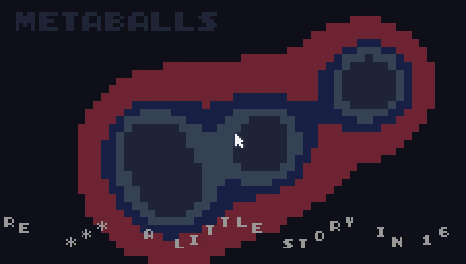

# outline26-claude-tic80



Claude's first attempt at a [TIC-80](https://tic80.com/) demo — a tiny
multi-scene journey through 16 colors, sine waves, and direct memory pokes.

Written iteratively in [conversation](PROMPTS.md) with Claude Opus 4.7.

**Watch:** a 150-second pixel-perfect capture of one full loop is committed
at [`demo-recording.mp4`](demo-recording.mp4) (960×544, h264 + AAC, 21 MB) or
on [YouTube](https://youtu.be/_vUn_xbWBt8).

## Story arc

The demo runs as a short narrative of "an AI learning to draw":

| # | Scene | Caption (Claude's POV) |
|---|---|---|
| 0 | title | "claude's first attempt — a tiny journey through 16 colors" |
| 1 | awakening | "...wait, I can draw?" |
| 2 | plasma | "what if I layer some sines together?" |
| 3 | starfield | "stars - just perspective on points" |
| 4 | tunnel | "deeper into the math" |
| 5 | metaballs | "distance fields - organic shapes" |
| 6 | rotozoom | "textures can spin and zoom" |
| 7 | cube3d | "depth! 8 points, 6 faces, 1 cube" |
| 8 | copper bars | "copper bars - homage to the amiga" |
| 9 | voxel | "and now... a whole world" |
| 10 | fire | "burning bright at the end" |
| 11 | fin | extended credits + greetings, music fades to silence |

Music intensity layers in across the story: pad-only at the title,
adding bass → lead → hihat → kick+snare as it builds toward the fire
finale, then fades out across the outro.

## Prompts

The full conversation log of prompts that drove this demo is in
[`PROMPTS.md`](PROMPTS.md).

## Audio without cart data

All four waveforms (triangle, square, saw, noise) and six SFX slots are
built at boot by poking directly into TIC-80 RAM:

- Waveforms → `0x0FFE4` (16 waves × 16 bytes)
- SFX → `0x100E4` (64 sfx × 66 bytes)
- Palette fade → `0x03FC0`

So `demo.tic` carries no sound data on disk — every note in the chiptune
is synthesised live from a square wave (or saw, or noise) we wrote into
memory at startup.

## Running

The cart was built and tested with **TIC-80 v1.1.2837** via Flatpak.
A locally-built dev `1.2.3077-dev` was found to segfault during cart
load, so the stable Flatpak is recommended.

```sh
# install once
flatpak install flathub com.tic80.TIC_80

# run the cart
flatpak run com.tic80.TIC_80 --skip --fs . demo.tic --cmd "run"
```

To rebuild `demo.tic` from `demo.lua`:

```sh
rm -f demo.tic
flatpak run com.tic80.TIC_80 --skip --fs . \
  --cmd "new lua & import code demo.lua & save demo.tic" --cli
```

## Size

- `demo.lua` — **18.7 KB** (753 lines)
- `demo.tic` cart — **19.0 KB** (TIC-80 Pro cart limit is 256 KB, so ~7%)

Where the bytes go (rough breakdown):

| Section | Approx | What's in there |
|---|---:|---|
| Memory pokes | 1.1 KB | palette save + 4 waveforms + 6 SFX entries, all built at boot via direct RAM pokes |
| Runtime state | 1.7 KB | rotozoom texture, starfield, fire buffer, metaballs, cube data, voxel heightmap |
| Effect scenes | 6.6 KB | plasma, starfield, tunnel, rotozoom, fire, metaballs, cube3d, copper, voxel (≈9 scenes × ~700 B each) |
| Story scenes | 4.8 KB | awakening (primitive bloom), ~80-line credits scroll, outro background, title intro |
| Main loop | 2.6 KB | scene dispatch, palette-fade transition, music sequencer, scene-advance timing |
| Other | 1.9 KB | header, story text, ui helpers, music patterns |

The two largest single functions are **voxel** (~1.4 KB — banking S-curve
camera, heightmap raycast, 8-band coloring, distance fog) and the
**main TIC()** loop (~2.6 KB — does the per-frame dispatch, palette
restore + fade, and 4-channel music sequencing).

For comparison, the [`minimal`](https://github.com/annejan/outline26-claude-tic80/tree/minimal)
branch fits four effects (plasma / starfield / tunnel / fire) into
**~880 bytes** by dropping the story, scroller, captions, music,
transitions, and metadata — an exercise in TIC-80 size-coding.

## Branches

- `main` — the full 744-line storytelling demo
- `minimal` — a byte-coded ~882-byte version of the original four scenes
  (plasma, starfield, tunnel, fire), as an exercise in TIC-80 size-coding

## Greetings

To annejan, the demoscene, nesbox, anthropic, all chiptune nerds, all
pixel artists, all fantasy console fans, all sceners past and present,
and to everyone reading this right now. ♡

## License

MIT — see [LICENSE](LICENSE) if present, otherwise consider the code
under MIT terms.
